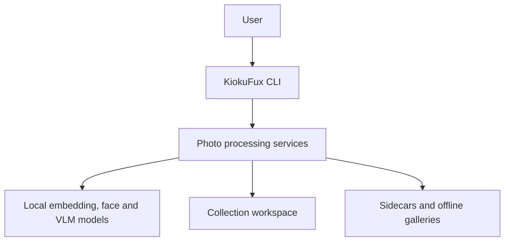
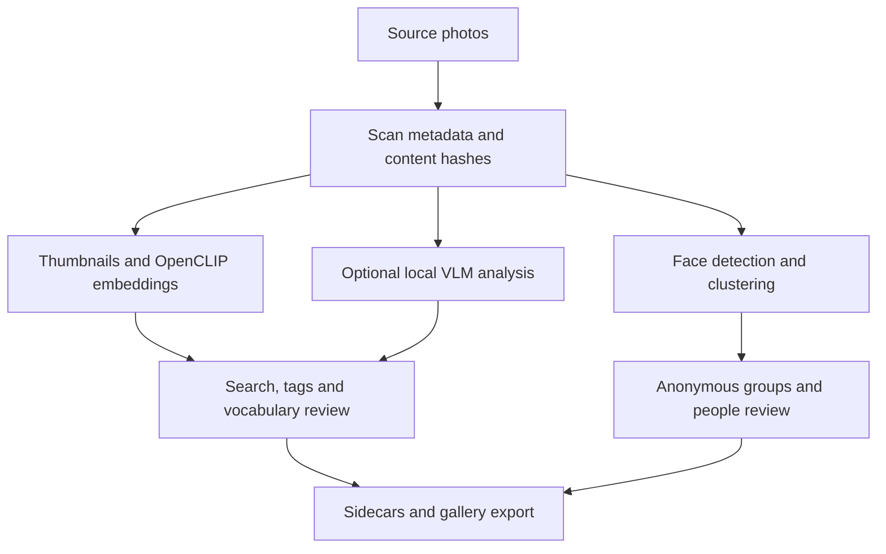
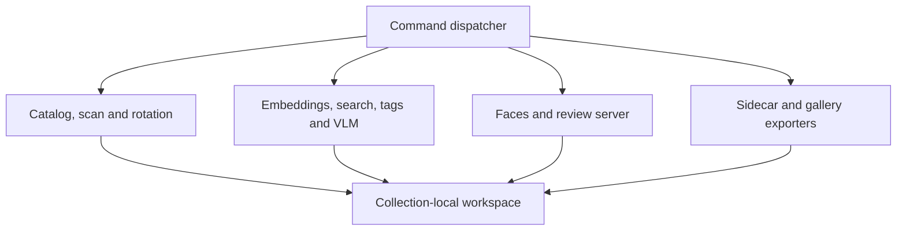
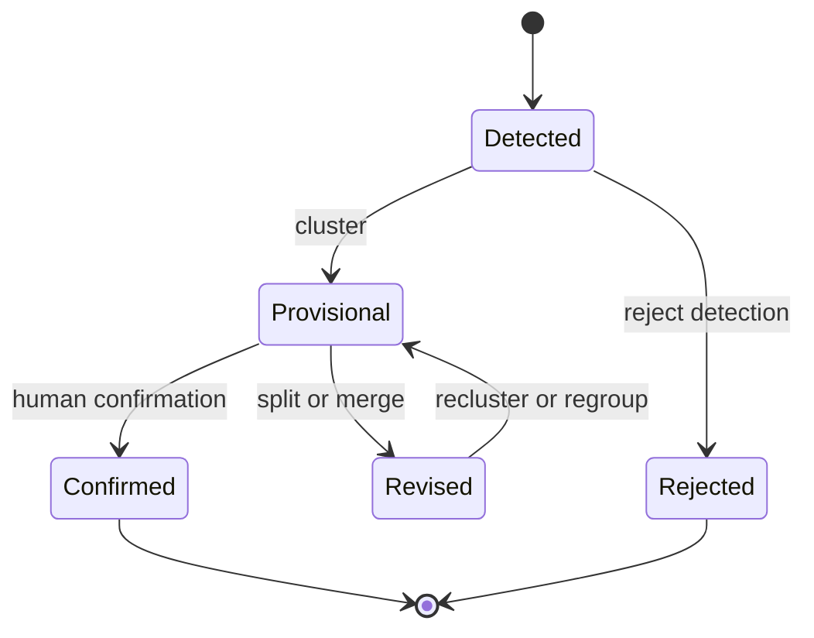
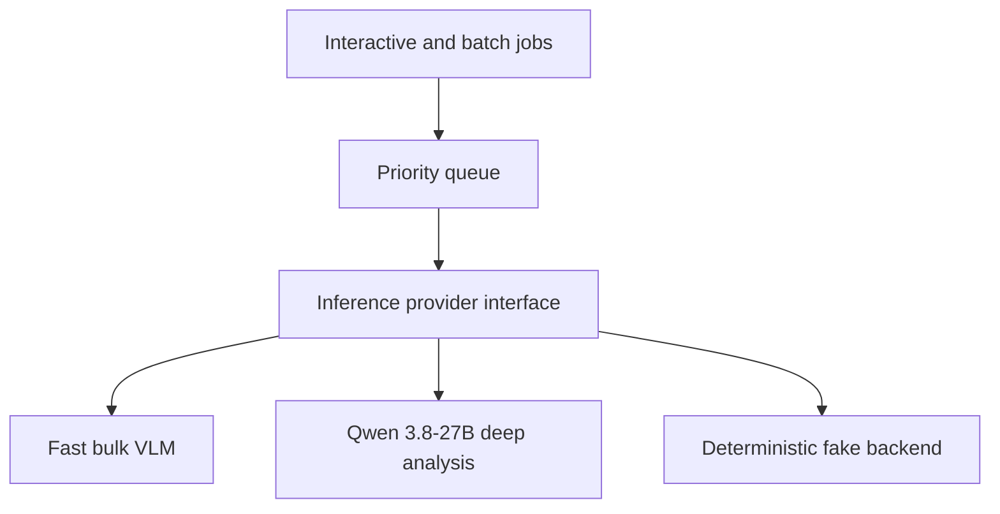

# KiokuFux architecture

This document describes the architecture currently present on the main branch and
separates it from proposed extensions. KiokuFux is a local-first photo archive:
original photographs remain authoritative, AI output is reviewable, and biometric
derived data stays inside the collection workspace.

## Current system context

<!-- diagram: system-context -->

The local face-review server is loopback-only by default. Static gallery exports
are standalone HTML, CSS and JavaScript and do not require a hosted service.

## Current processing architecture

<!-- diagram: processing-pipelines -->

OpenCLIP or the fallback backend supports retrieval and tag proposals. VLM output
adds captions, descriptions and structured evidence but does not replace the
embedding index. Face clusters are suggestions: only explicit review creates a
stable person.

## Current components and stores

<!-- diagram: components -->

| Store | Authority | Rebuildable | Notes |
| --- | --- | --- | --- |
| Source photographs | Original content | No | Normally read-only; rotation is explicit and backed up |
| catalog.sqlite | Operational catalog | Yes | Paths, metadata and processing state |
| embeddings and thumbnails | Derived artifacts | Yes | Bound to model and source versions |
| faces.sqlite | Derived face index | Yes | Contains biometric-derived embeddings |
| people.json | Human-reviewed identity state | No | Stable people and optional display names |
| face-review.json | Human review history | No | Preserve across reclustering |
| .kiokufux.json sidecars | Portable export | Yes | No face embedding vectors |
| Static gallery | Publication derivative | Yes | Face data excluded unless explicitly enabled |

## Identity lifecycle

<!-- diagram: face-lifecycle -->

Automatic naming and demographic inference are outside the architecture. Review
state must survive model upgrades, path moves and safe re-clustering.

## Planned inference architecture

The following target is not yet the implementation on main.

<!-- diagram: target-inference -->

The fast VLM remains appropriate for bulk processing. Qwen 3.8-27B should be a
selective deep-analysis profile for uncertain photographs, richer captions,
OCR-heavy images, bounding boxes and multi-image narratives. Face recognition and
OpenCLIP retrieval remain separate specialist pipelines.

## Near-term roadmap

1. Repair and finish pull request 23 so security CI becomes a trustworthy baseline
   rather than merging a failing gate.
2. Introduce a provider-neutral VLM interface around the existing fake and Ollama
   implementations.
3. Record model, quantization, prompt version and inference settings with every VLM
   result so analyses can be invalidated and compared safely.
4. Add a priority job queue: interactive review requests must run before bulk
   captioning on the shared RTX 4090 server.
5. Benchmark Qwen3-VL-8B against Qwen 3.8-27B on a representative, reviewed photo
   set before changing defaults.
6. Use the 27B model only for uncertain or explicitly selected images at first;
   keep OpenCLIP for collection-wide search.
7. Profile gallery and tag filtering with the real approximately 3,000-photo
   collection before introducing an approximate vector index.
8. Continue the Story Gallery as a separate application layer over reviewed
   catalog data, not as another source of identity or metadata truth.

## Diagram generation

GitHub renders the Mermaid blocks above directly. To generate standalone SVGs:

    python scripts/render_architecture.py

The renderer discovers every Mermaid block preceded by a diagram comment and
writes SVG files to build/architecture. The architecture workflow performs the
same rendering on relevant pull requests and uploads the SVGs as a workflow
artifact. Generated files are deliberately not committed.
